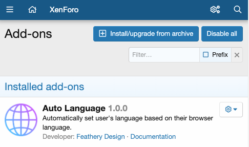

Installation
========

First of all, install the addon like every other addon by uploading it directly via SFTP or the control panel.

For the control panel method you need php zip::

	sudo apt-get install php-zip
  sudo yum install php-zip

Features
--------

- Be awesome
- Make things faster

Installation
------------

Install $project by running:

    install project

Contribute
----------

- Issue Tracker: github.com/$project/$project/issues
- Source Code: github.com/$project/$project

Support
-------

If you are having issues, please let us know.
We have a mailing list located at: project@google-groups.com

License
-------

The project is licensed under the BSD license.
