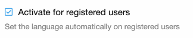
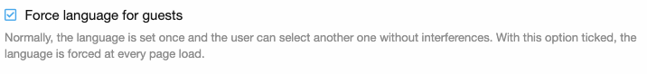
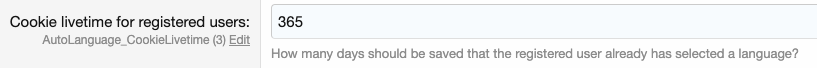

========
Configuration
========

The configuration is pretty straightforward.
Out of the box, guests and registered users language gets changed automatically.

You can disable the Auto Language function for registered users by unticking the box.

The addon saves in the cookies, that a language has been automatically set. This allows the user to change his language manually without interferences.
If you tick this option, the automatically detected language is forced for guests at every page load.

This cookie can be saved many months for registered users. Type in "0" for keeping the setting only for the session. (not recommended)

