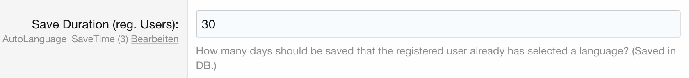

========
Configuration
========

The configuration is pretty straightforward.
Out of the box, guests and registered users language gets changed automatically.

You can disable the Auto Language function for registered users by unticking the box.

.. image:: registered_users.png
  :width: 400
  :alt: Option1

Saving
------
The addon saves when a language has been automatically selected for the user. This allows the user to change his language manually without interferences.

Guests
^^^^^
If you tick this option, the automatically detected language is forced for guests at every page load.

.. image:: force.png
  :width: 550
  :alt: Option2

Users
^^^^^
For all registered users the information is saved in the database. How long should it be stored?

