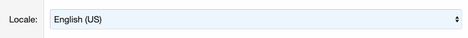

============
1. Get started
============

How it works
--------
Every browser sends its preffered language in the HTTP Header.
This addon compares it to all installed languages and sets the right one automatically.

Requirements
--------
Beside the normal requirements for a XF 2.1 installation, all installed languages need to have a language code.

In most cases you don't need to do anything, good translations have this option set up.
